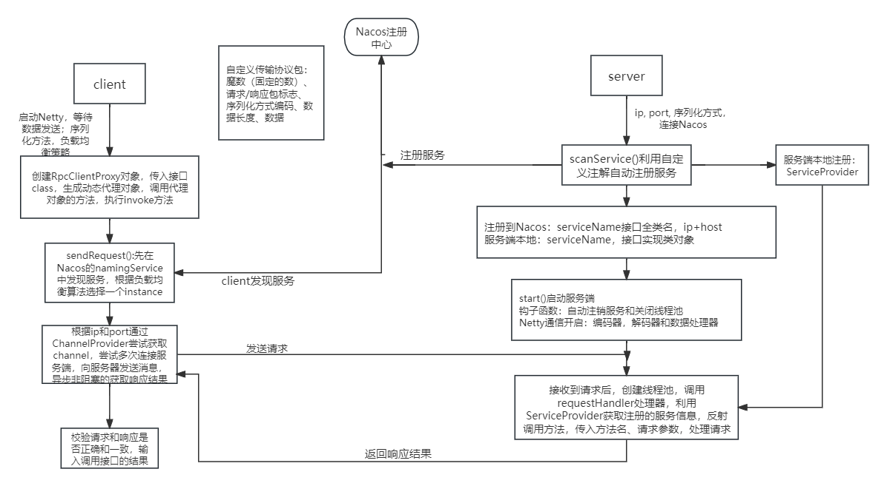
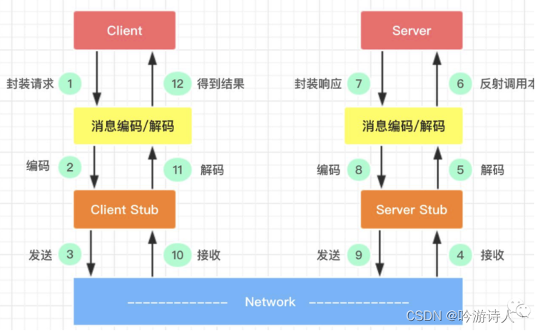

  
images文件夹：Readme所用到的图片（其实只有一张）  
rpc-api文件夹：服务端与客户端的公共调用接口  
rpc-common文件夹：项目中的一些通用的枚举类和工具类  
rpc-core文件夹：框架的核心实现  
test-client文件夹：测试用的客户端项目  
test-server文件夹：测试用的服务端项目  
.gitignore：就是.gitignore  
README.md：就是Readme  
pom.xml：项目的总的pom  
本项目架构：  
  
RPC调用流程:  
1.服务消费方（client）调用以本地调用方式调用服务；  
2.client stub接收到调用后负责将方法、参数等组装成能够进行网络传输的消息体；  
3.client stub找到服务地址，并将消息发送到服务端；  
4.server stub收到消息后进行解码；  
5.server stub根据解码结果调用本地的服务；  
6.本地服务执行并将结果返回给server stub；  
7.server stub将返回结果打包成消息并发送至消费方；  
8.client stub接收到消息，并进行解码；  
9.服务消费方得到最终结果。    
RPC的目标就是要2~8这些步骤都封装起来，让用户对这些细节透明:  
