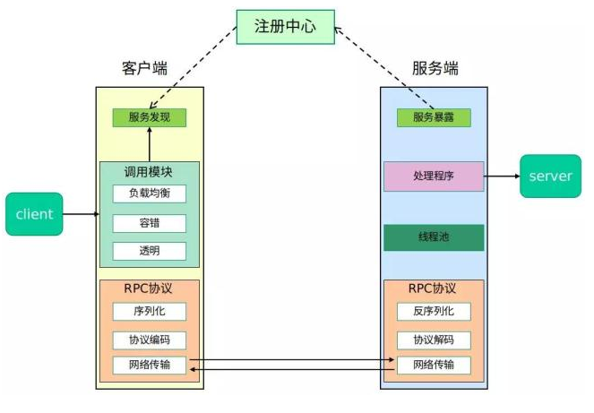

images文件夹：Readme所用到的图片（其实只有一张）  
rpc-api文件夹：服务端与客户端的公共调用接口  
rpc-common文件夹：项目中的一些通用的枚举类和工具类  
rpc-core文件夹：框架的核心实现  
test-client文件夹：测试用的客户端项目  
test-server文件夹：测试用的服务端项目  
.gitignore：就是.gitignore  
README.md：就是Readme  
pom.xml：项目的总的pom